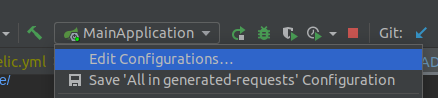
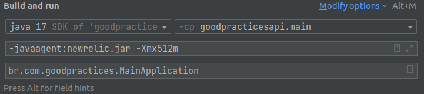

For run the compose from project:
```ssh
docker-compose -d
```

For run the migration flyway:
```ssh
./gradlew flywayMigrate -i
```

Swagger link (Open API)
```
http://localhost:8080/swagger-ui/index.html)
```

For run the tests:
```ssh
./gradlew clean test
```

Path to test report:
```
- ./build/reports/tests/test/index.html
```

Create the file  **`newrelic.yml`** and add this on your project file root. Obs: This file can be found into your account or in this link:
https://docs.newrelic.com/docs/apm/agents/java-agent/configuration/java-agent-config-file-template/

You need to change two params inside this file:
**app_name** e **license_key**

The license_key you going to find in this link:
https://one.newrelic.com/admin-portal/api-keys/home

Use the key TYPE: **INGEST - LICENSE** for license_key

For the field app_name, you can choose any name. I'm using `Good Practices API`

Latter that in your project configurations do that configurations

`-javaagent:newrelic.jar`
`-Xmx512m`


