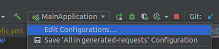

# Descrição

Este projeto foi criado com o propósito de implementar todas as boas práticas que eu conheço em um lugar único com o menor escopo possível.

Nele estou utilizando:

Java em sua última versão(17), com utilização de recursos como Record para os DTOS

Princípios **SOLID**

Para diminuição de código boilerplate

 - MapStruct 
 - Lombok

Modelo de maturidade de richardson no level 2 com pequenos detalhes do level 3 para a api Person.

Para database migration estou utilizando o **Flyway**, já observando algumas questões como url de conexão, usuário 
e senha sendo passados por parâmetros na execução, possibilitando utilizando de secrets no futuro(Ambiente produtivo)

Documentação de api utilizando 

- OpenAPI (Swagger)

Para monitoração da aplicação estamos utilizando:

- NewRelic
- Grafana

Sendo que para provelos estou utlizando docker-compose

Utilização de dtos para receber os objetos e também retornar as informações.

# Passo a passo

Para rodar o docker do projeto:
Utilize o comando sh docker-run.sh, pois nele contém configurações adicionais necessárias para o projeto.
```ssh
./docker-run.sh 
ou
docker-compose -d
```

Utilize o comando abaixo para executar o flyway db migration:
```ssh
./gradlew flywayMigrate -i
./gradlew flywayMigrate -i -Dflyway.user=pguser -Pflyway.password=pguser
./gradlew flywayMigrate -i -Dflyway.user=pguser -Pflyway.password=pguser -Pflyway.url=jdbc:postgresql://localhost:5432/pgdb
```

Swagger link (Open API)
```
http://localhost:8080/swagger-ui/index.html
```

Para rodar os testes:
```ssh
./gradlew clean test
```

Endereço para o relátorio de testes:
```
./build/reports/tests/test/index.html
```


### SonarQube

Quando o docker subir, a aplicação sonarqube ficará disponível no seguinte endereço:

```url
http://localhost:9000
```

Ao acessa-la, será redirecionado para a tela de login, as credências são:
```
login: admin
password: admin
```
Ao realizar o primeiro acesso, será pedido para alterar a senha, no caso coloque a senha como **sonar** para que o nosso exempo funcione.
Esta senha é utilizada no **build.gradle** do nosso projeto.

#### Subindo relatório de testes para o sonarqube
Uma vez que o seu sonarqube está configurado, é necessário subir a avaliação para ele.
Para que isso seja feito é necessário rodar os testes, com o seguinte comando:
```ssh
./gradlew clean test
```
Assim será gerado o relatório do jacoco que será utilizado como base de informações para o sonar, parar enviar o relatório para o site, basta rodar:
```ssh
./gradlew sonarqube
```
Assim você pode ir no site e verificar a saúde da sua aplicação.
```
http://localhost:9000/dashboard?id=Good-Practices-API
```


### New Relic

Crie o arquivo **`newrelic.yml`** e adicione na raiz do seu projeto, este arquivo pode ser encontrado na sua conta do newrelic e no link:

https://docs.newrelic.com/docs/apm/agents/java-agent/configuration/java-agent-config-file-template/

Você precisa substituir dois parâmetros dentro do arquivo:

**app_name** e **license_key**

O license_key você vai encontrar no link

https://one.newrelic.com/admin-portal/api-keys/home

Utilize a chave to tipo TYPE: **INGEST - LICENSE** para o license_key

E para o campo app_name, de o nome que mais fizer sentido para a sua aplicação, no nosso caso estamos utilizando `Good Practices API`

Logo após configurar o seu arquivo

Adicione estes argumentos no seu run environment do cli arguments do java
`-javaagent:newrelic.jar`
`-Xmx512m`


