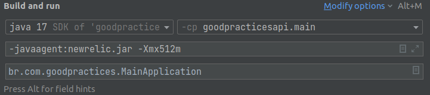

Para rodar o docker do projeto:
```ssh
docker-compose -d
```

Utilize o comando abaixo para executar o flyway db migration:
```ssh
./gradlew flywayMigrate -i
```

Swagger link (Open API)
```
http://localhost:8080/swagger-ui/index.html
```

Para rodar os testes:
```ssh
./gradlew clean test
```

Endereço para o relátorio de testes:
```
- ./build/reports/tests/test/index.html
```

Crie o arquivo **`newrelic.yml`** e adicione na raiz do seu projeto, este arquivo pode ser encontrado na sua conta do newrelic e no link:

https://docs.newrelic.com/docs/apm/agents/java-agent/configuration/java-agent-config-file-template/

Você precisa substituir dois parâmetros dentro do arquivo:

**app_name** e **license_key**

O license_key você vai encontrar no link

https://one.newrelic.com/admin-portal/api-keys/home

Utilize a chave to tipo TYPE: **INGEST - LICENSE** para o license_key

E para o campo app_name, de o nome que mais fizer sentido para a sua aplicação, no nosso caso estamos utilizando `Good Practices API`

Logo após configurar o seu arquivo

Adicione estes argumentos no seu run environment do cli arguments do java
`-javaagent:newrelic.jar`
`-Xmx512m`


